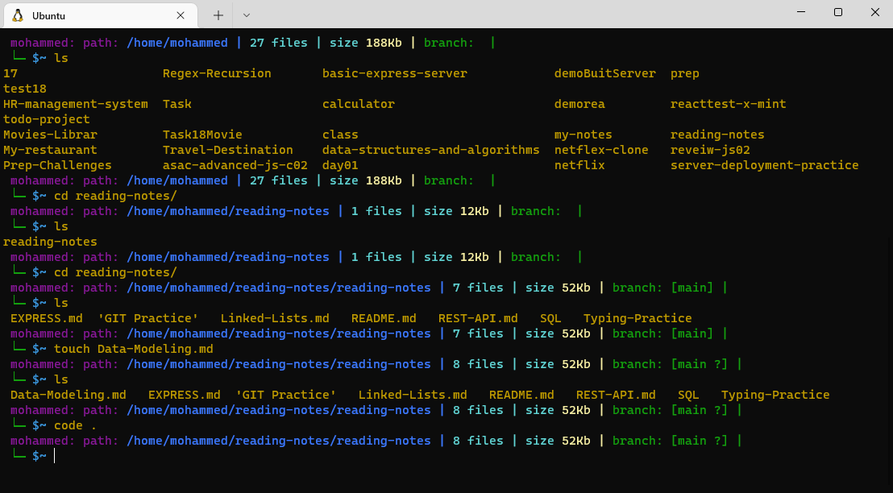
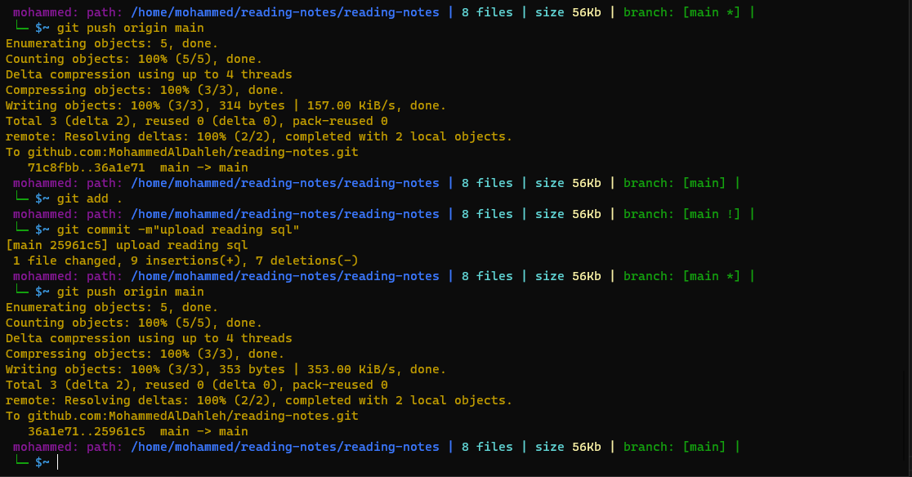
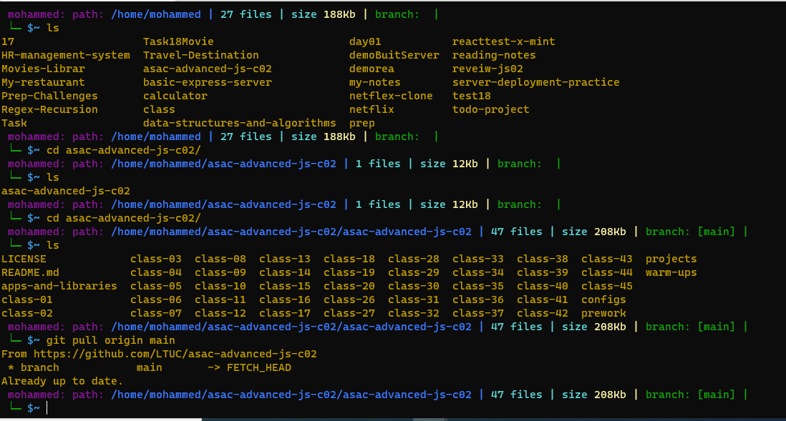
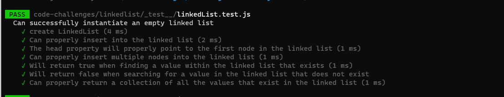

# Introduction

 
* Linux has a graphical user interface and it works pretty much like the GUI's on other systems that you are familiar with such as Windows and OSX. This tutorial won't focus on these as I reckon you can probably figure that part out by yourself. This tutorial will focus instead on the command line (also known as a terminal) running Bash.

* The command line is an interesting beast, and if you've not used one before, can be a bit daunting. Don't worry, with a bit of practice you'll soon come to see it as your friend. Don't think of it as leaving the GUI behind so much as adding to it. While you can leave the GUI alltogether, most people open up a command line interface just as another window on their desktop (in fact you can have as many open as you like). This is also to our advantage as we can have several command lines open and doing different tasks in each at the same time. We can also easily jump back to the GUI when it suits us. Experiment until you find the setup that suits you best. As an example I will typically have 3 terminals open: 1 in which I do my working, another to bring up ancilliary data and a final one for viewing Manual pages (more on these later).

* We have more commands like this:
1. mkdir : make a directory
2. cd / cd .. : change a directory
3. pwd : print working directory
4. explorer.exe . : open GUI in my current worrkspace
5. ls : list 
6. touch : create a file
7. cat : to see what inside the file
8. nano : to open the file like text editor
9. rmdir / rm -rf : remove directory
10. tree : show like the list but with the branches
11. .folder : hidden folder
12. ls -a : see all folders hidden or not 
13. clear : to clear the commands 
14. ls -p : to mark the folder with / 
15. date : to show the date
16. curl wttr.in/the name of the city : to show the weather
17. shell.how : website to show the meaning of commands

